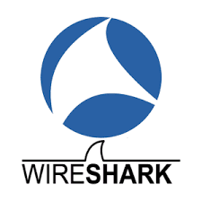
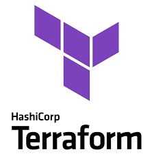
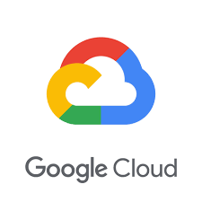

# 💫 About Me

  

 
- 🔠Cybersecurity Engineer with 6+ years of hands-on experience in design&building robust security solutions 
- 👌 Proficient in low-level and system-level programming with c/c++, c#, go, java and seasoned in advanced security frameworks and tools 
- 👠Experienced in DevOps, CI/CD, and Cloud infrastructure, especially with AWS, DigitalOcean, GCP and Azure 
 
- 🤠Often collaborating with IT departments, startups, ensure compliance with cybersecurity regulations, educate staff on safe practices, and stay updated on emerging threats 

# 💻 My SkillSet
---

### Languages

 
 

### Database

 
 

### Tools

 

 

### Frameworks and Platforms

 

 

### DevOps and Cloud

 

 

### Certificates

 
 

### Others

  

### 

### 

